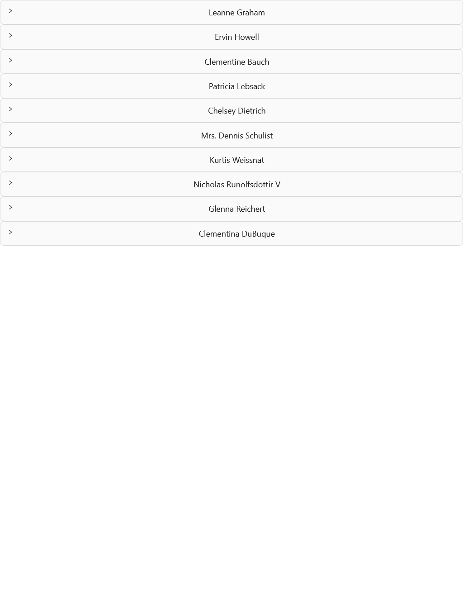
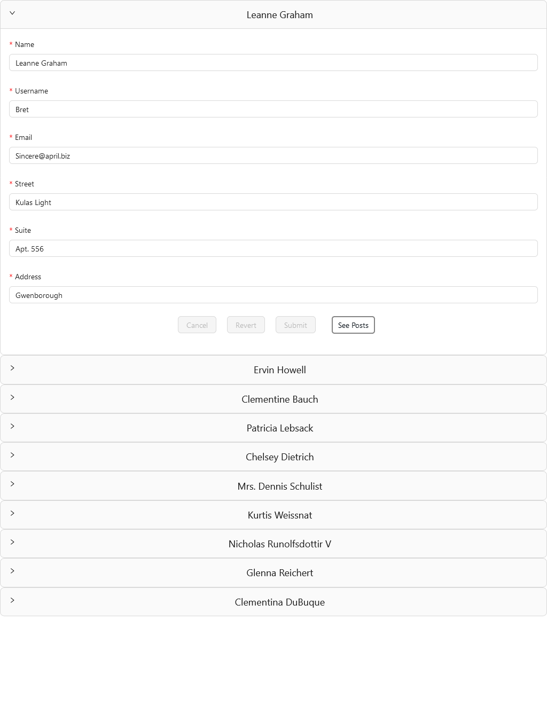
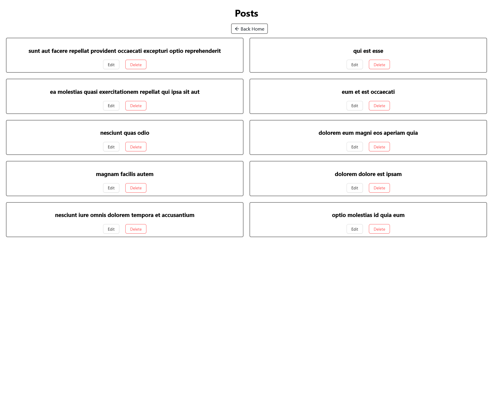
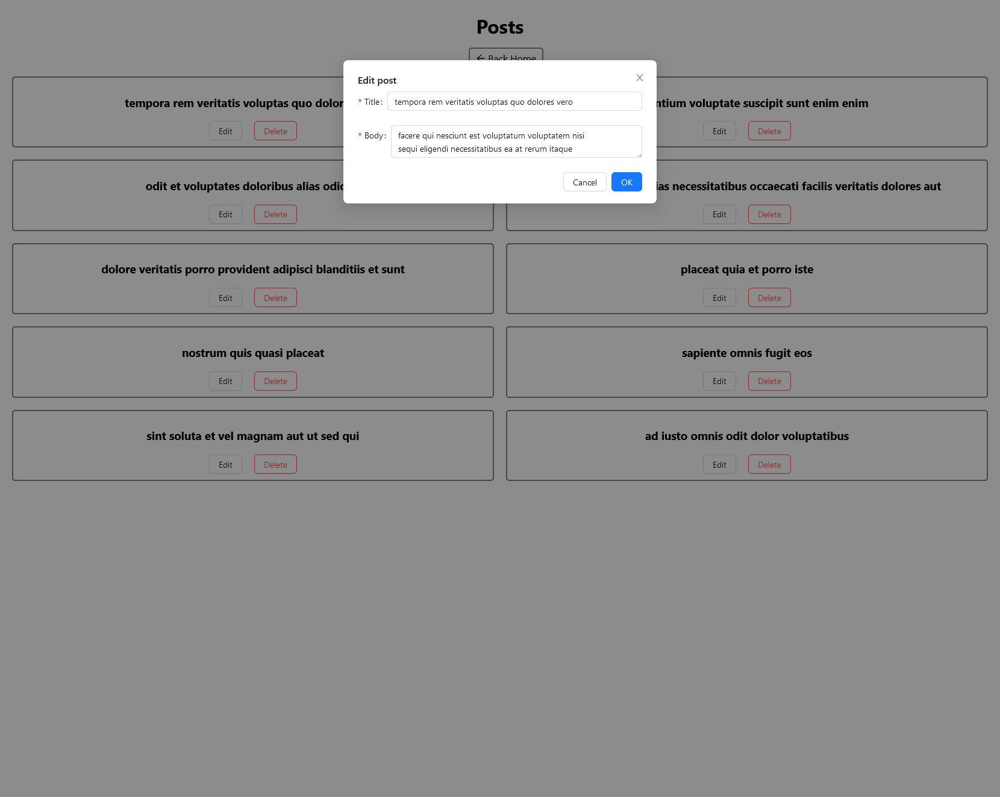

<h1 align="center"><i>Interview Task </i></h1>

**_
 This API is designed to manage users and posts by allowing them to be created, read, updated, and deleted (CRUD operations).
_**

<h4 align="center"><i>Stack: </i></h3>

- <i><b> React with Typescript</b></i>
- <i><b>State management - Redux and redux-toolkit</b></i>
- <i><b>Axios</b></i>
- <i><b>Antd</b></i>
- <i><b>Backend - JSONPlaceholder API</b></i>

<h4 align="center"><i>Pages: </i></h3>
- <i><b>Home page (users)</b></i>

- <i><b>Posts page (user post)</b></i>

